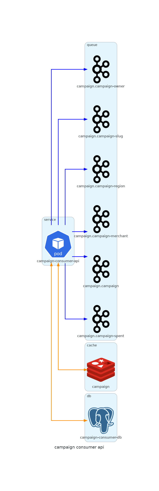

# Cmapaign Consumer Api
Service worker responsible for:
- consumption of campaign events and
- campaign management

## Impacts of service interruption
The information displayed on the Partner Portal may be out of date. As well as the campaigns displayed on the APP.

## Doc
[Documentation Ads Data Ingestor](https://github.com/VanessaVallarini/campaign-consumer-api)

## Technologies and Dependencies
* Golang 1.22

## Running local
### Requirements:
- docker

### Secrets Env:
Make a copy of the secret-env.yml.template file by running the command below and replace the values ​​with your credentials.
The environments must be the same names as the k8s files (values-production and values-sandbox).
```shell
cp ./local/secret-env.yml.template ./local/secret-local.yml
```

### Override Config:
Run the command below according to the environment you want (local, sandbox or production):
| Command                | Environment|
|------------------------|------------|
| make config-local      | local      |
| make config-sandbox    | sandbox    |
| make config-production | production |

#### Launch
```shell
{
    "version": "0.2.0",
    "configurations": [
        {
            "name": "Launch Package",
            "type": "go",
            "request": "launch",
            "mode": "debug",
            "cwd": "${workspaceFolder}",
            "program": "${cwd}/cmd/campaign-consumer-api/main.go"
        }
    ]
}
```

### Starting docker-compose (using kafka local):
```shell
make compose-infra-up
```

### Starting docker-compose (using kafka sandbox/production):
```shell
        docker run -p 8090:8080 \
    -e KAFKA_BROKERS=KAFKA_BROKERS \
    -e KAFKA_TLS_ENABLED=true \
    -e KAFKA_SASL_ENABLED=true \
    -e KAFKA_CLIENT_ID=campaign-consumer-api \
    -e KAFKA_SASL_USERNAME=KAFKA_SASL_USERNAME \
    -e KAFKA_SASL_PASSWORD=KAFKA_SASL_PASSWORD \
    -e KAFKA_SASL_MECHANISM=SCRAM-SHA-512 \
    -e KAFKA_SCHEMAREGISTRY_ENABLED=true \
    -e KAFKA_SCHEMAREGISTRY_URLS=KAFKA_SCHEMAREGISTRY_URLS \
    -e KAFKA_SCHEMAREGISTRY_USERNAME=KAFKA_SCHEMAREGISTRY_USERNAME \
    -e KAFKA_SCHEMAREGISTRY_PASSWORD=KAFKA_SCHEMAREGISTRY_PASSWORD \
    docker.redpanda.com/vectorized/console:master-8271963
```
*Note: Before executing the command above, which starts Docker, you need to replace the the fields "KAFKA_"

#### Launch
```shell
{
    "version": "0.2.0",
    "configurations": [
        {
            "name": "Launch Package",
            "type": "go",
            "request": "launch",
            "mode": "debug",
            "cwd": "${workspaceFolder}",
            "program": "${cwd}/cmd/campaign-consumer-api/main.go"
        }
    ]
}
```

### Starting App:
Now just run the `make air` command (with air, in addition to building the application, it also allows live reloading. If it has not been started, just run `make air-init`) to run the application.

### Stop docker-compose:
```shell
make compose-infra-down
```

## Architecture
